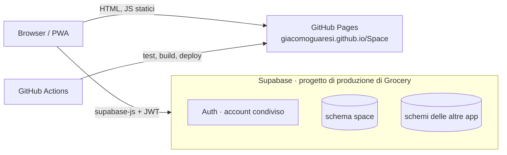

# 04 · Architettura

## Schema generale



## Come funziona

1. **GitHub Pages** serve solo file statici.
2. L'**universo si calcola nel browser**: seed, corpo, nome e grafica di ogni settore ([03](03-universo.md)). Per guardare lo spazio non serve nessuna chiamata.
3. Il **database** conserva solo lo stato del gioco: nave, viaggi, scoperte, risorse, colonie, potenziamenti ([05](05-modello-dati.md)).
4. **Le azioni passano da funzioni Postgres** (`space.viaggia`, `space.raccogli`, `space.colonizza`, `space.potenzia`…). Le funzioni controllano le regole e scrivono il risultato; il browser non scrive mai direttamente posizione, carburante o risorse. Per sapere cosa c'è in un settore usano l'hash scritto in SQL.
5. **Tutto si calcola alla lettura, senza job programmati**: posizione della nave (arrivata se `arrivo <= now()`), carburante ricaricato, produzione delle colonie, costruzioni finite. Si salvano gli istanti di partenza e di ultima raccolta, il resto si ricava da `now()`.
6. **Row Level Security**: ognuno vede e modifica solo i propri dati. Quando arriveranno altri giocatori, gli insediamenti diventeranno condivisi ([02](02-meccaniche.md#altri-giocatori-più-avanti)) e la RLS andrà rivista.

## Convivenza con le altre app

Come Projects e Trekking:

- **Schema Postgres dedicato `space`**, aggiunto agli *Exposed schemas*; il client si crea con `db: { schema: 'space' }`.
- **Autenticazione condivisa**: stesso account delle altre app.
- **Migrazioni** in `supabase/sql/NNN_descrizione.sql`, numerate e applicate a mano. Lo storico della CLI resta a Grocery.
- **Keep-alive**: non serve.

## Stack

| Livello | Scelta | Note |
|---|---|---|
| Linguaggio | TypeScript | |
| UI | React 19 | pannelli, scanner, catalogo |
| Build | Vite, `base: '/Space/'` | |
| Routing | hash router | |
| Stile | Tailwind CSS | palette scura, da definire |
| Grafica | three.js + shader GLSL | generatori procedurali per corpo |
| Dati e accesso | @supabase/supabase-js | |
| PWA | vite-plugin-pwa | |
| Test | Vitest, sulla logica pura | hash, casuale, catalogo, nomi, distanze, tempi, carburante, produzione |
| CI/CD | GitHub Actions | |

## Struttura cartelle (prevista)

```
Space/
├── README.md · Q&A.md · LICENSE
├── doc/
├── src/
│   ├── dominio/          # hash, casuale, catalogo, nomi, viaggi: logica pura con test
│   ├── grafica/          # scena three.js e un generatore per corpo
│   ├── dati/             # chiamate a Supabase
│   └── pagine/
└── supabase/sql/
```
